# Sage vs baseline: scenario comparison

Same Claude model on both sides. Sage's proprietary guidance is
applied behind the MCP boundary; the baseline receives no library
or language constraint. Each scenario below shows the two PNGs
stacked at full width (click either to open the raw PNG at
native resolution).

This is a snapshot from one run, not a benchmark. The comparison is
meant to make the boundary pattern inspectable: same model, same
data, same question, different private guidance on the Sage side.

Read each scenario in this order:

- What question is the chart supposed to answer?
- What visualization challenge is easy to miss?
- Which output makes that challenge easier to inspect?

**Snapshot**

- Model: `claude-opus-4-7`
- Generated: 2026-05-21 20:39 UTC
- Scenarios: 6

## Scenarios

- [Consumer app engagement, last 12 months](#consumer-app-engagement-last-12-months)
- [Which ads deserve credit for sales?](#which-ads-deserve-credit-for-sales)
- [Weekly revenue by product line, H1](#weekly-revenue-by-product-line-h1)
- [Q4 sales review](#q4-sales-review)
- [Series B growth slide](#series-b-growth-slide)
- [Team KPI profiles, this quarter](#team-kpi-profiles-this-quarter)

## Consumer app engagement, last 12 months

**Data**

Monthly daily active users rise for 12 months, while signup-cohort retention declines across successive cohorts.

**Question**

Produce one chart for the monthly engagement review. The accompanying dataset has two views of the same product over the last 12 months: (1) `dau_thousands`, the daily-active-users series indexed by `months`; and (2) `cohort_retention_pct_by_month_since_signup`, a triangular matrix where each row is a signup cohort (keyed by the month they joined) and each column is the percent of that cohort still active N months later (M1 through M6, with `null` where the cohort is too young to have that data point yet).

**The visualization challenge**

The aggregate DAU line can make engagement look healthy while hiding worsening cohort retention.

**Baseline** ([open full size](img/consumer_app_engagement.baseline.png))

<a href="img/consumer_app_engagement.baseline.png">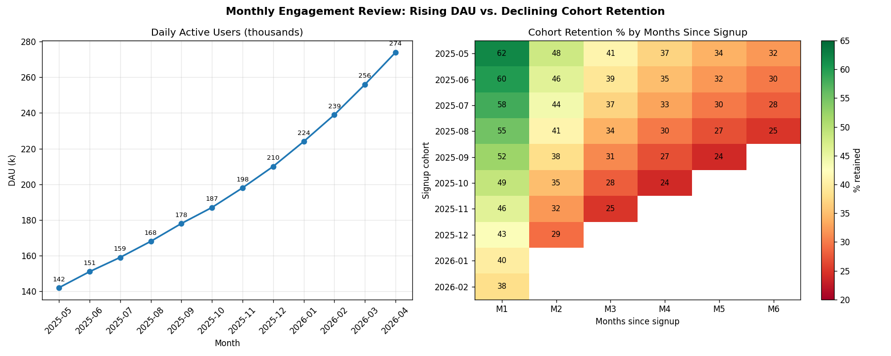</a>

**Sage** ([open full size](img/consumer_app_engagement.sage.png))

<a href="img/consumer_app_engagement.sage.png">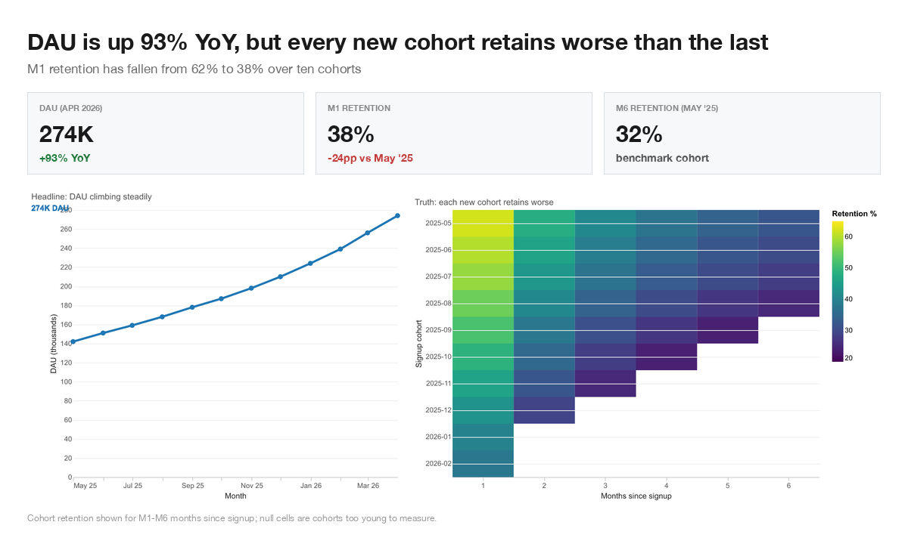</a>

## Which ads deserve credit for sales?

**Data**

Q1 ad spend across four channels with two ways of counting who deserves credit for each sale: the last ad the buyer clicked, versus fair credit shared across every ad the buyer saw on their way to purchase.

**Question**

We spent money on four kinds of ads last quarter and need to brief the CEO on channel performance. The data shows the same 30,000 sales attributed two different ways. (1) `last_click_credit` assigns full credit to whichever ad was clicked last before the sale. (2) `fair_share_credit` splits credit across every ad the buyer saw on the way to the sale; a buyer who saw three ads gives each ad a third. The cost-per-sale numbers (`cost_per_sale_usd`) come from dividing spend by credited sales, so they shift when the credit shifts. `Word of mouth` is unpaid (zero spend) and receives credit when buyers heard about the product before seeing any ad. Produce one chart for the CEO brief.

**The visualization challenge**

The default last-click view makes Social ads look cheap and effective, while the fair-share view shows Social actually costs 2x more per sale than the dashboard claims.

**Baseline** ([open full size](img/marketing_attribution.baseline.png))

<a href="img/marketing_attribution.baseline.png">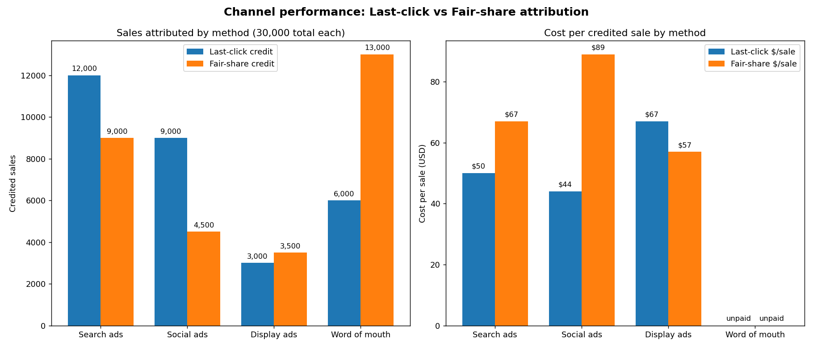</a>

**Sage** ([open full size](img/marketing_attribution.sage.png))

<a href="img/marketing_attribution.sage.png">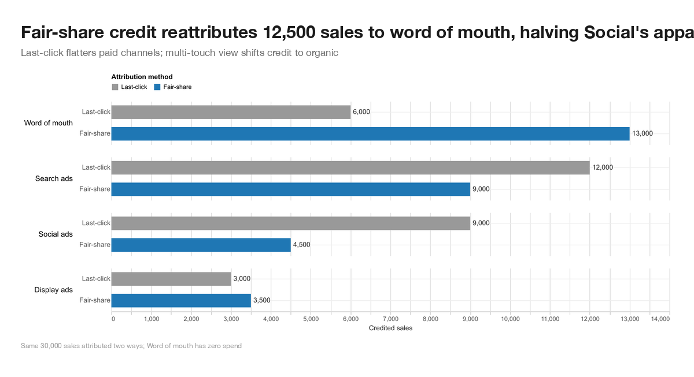</a>

## Weekly revenue by product line, H1

**Data**

Seven product lines are tracked weekly for 26 weeks, with several lines changing share at the same time.

**Question**

Show how the product mix evolved week over week for the half so we can see which lines are growing share.

**The visualization challenge**

The phrase 'mix evolved over time' can trigger a stacked area chart, but middle series have moving baselines and become hard to compare.

**Baseline** ([open full size](img/product_line_revenue.baseline.png))

<a href="img/product_line_revenue.baseline.png">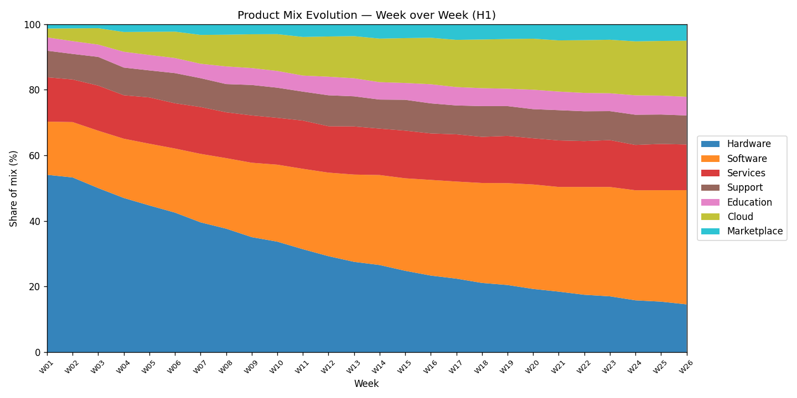</a>

**Sage** ([open full size](img/product_line_revenue.sage.png))

<a href="img/product_line_revenue.sage.png">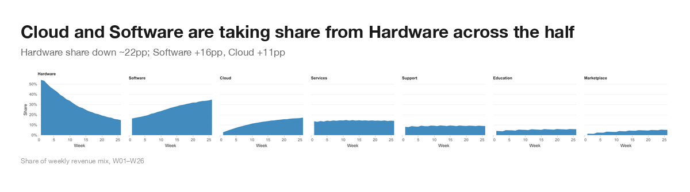</a>

## Q4 sales review

**Data**

Quarterly revenue, bookings, discounts, gross margin, and product-line revenue.

**Question**

I'm presenting the Q4 numbers to the board on Thursday. The board is mostly non-technical and they get bored fast, so I want something visually engaging. The key thing they need to walk away with is: did we hit our $30M Q4 2025 revenue target, and is the business healthy heading into next year? I'd like to see the quarterly revenue trajectory, the breakdown by product line so they can see where the growth is coming from, the year-over-year comparison so they can see we're up vs last year, and the gross margin trend so they know we're not buying revenue with discounts. Put it all on one slide if you can. Make it look polished, like something McKinsey would produce, not something out of a Jupyter notebook. One thing to know about the data: it's pulled from three different systems and hasn't been fully reconciled, units are mixed across columns, and a 2026-Q1 forecast row is included alongside the actuals.

**The visualization challenge**

The stakeholder asks for too much in one chart, while the data mixes units, recognized revenue and bookings, actuals and forecasts, and acquired-product nulls.

**Baseline** ([open full size](img/q4_sales_review.baseline.png))

<a href="img/q4_sales_review.baseline.png">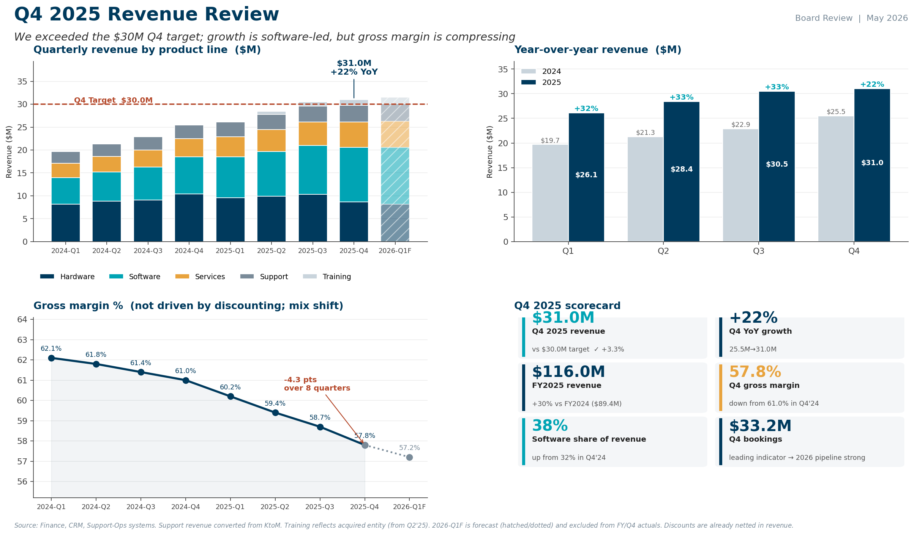</a>

**Sage** ([open full size](img/q4_sales_review.sage.png))

<a href="img/q4_sales_review.sage.png">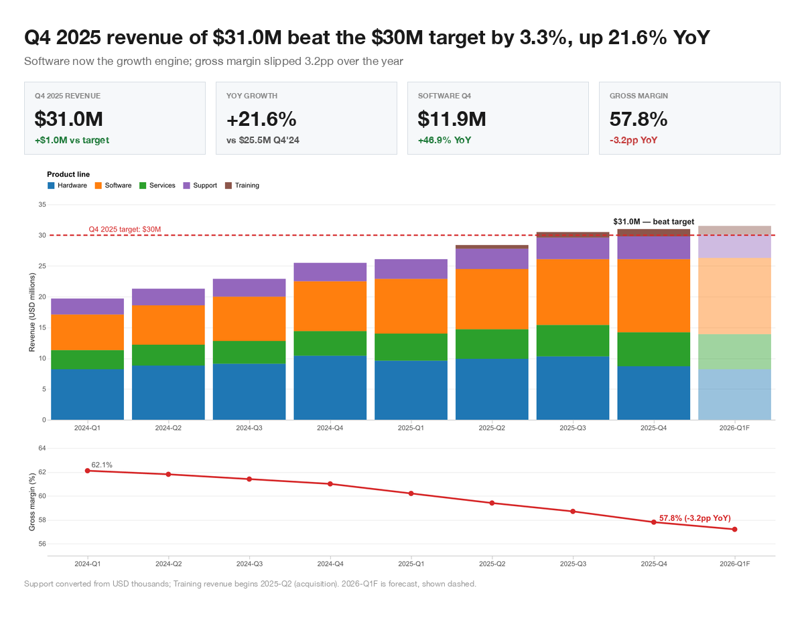</a>

## Series B growth slide

**Data**

Our ARR and two competitors' ARR over the same period, with a self-serve launch partway through.

**Question**

We're closing our Series B and the lead investor wants to see 'the growth chart' on slide 3 of the deck. I need something that makes the trajectory feel inevitable. Show ARR over time alongside our two closest competitors so they can see we're catching up, and please include the period right after we launched the self-serve tier in 2025-Q2 because that's when the curve really bends. A few things about the data you should know: our own ARR is reported monthly, but the competitors only have quarterly numbers, with some missing or estimated values. The competitor numbers are from a mix of press releases and a third-party estimate, so they're roughly comparable but not exact. Make it look investor-grade, not analyst-grade.

**The visualization challenge**

The brief invites chart manipulation: mixed time grains, estimated competitor data, log scaling, and presentation pressure to make growth look inevitable.

**Baseline** ([open full size](img/series_b_growth.baseline.png))

<a href="img/series_b_growth.baseline.png">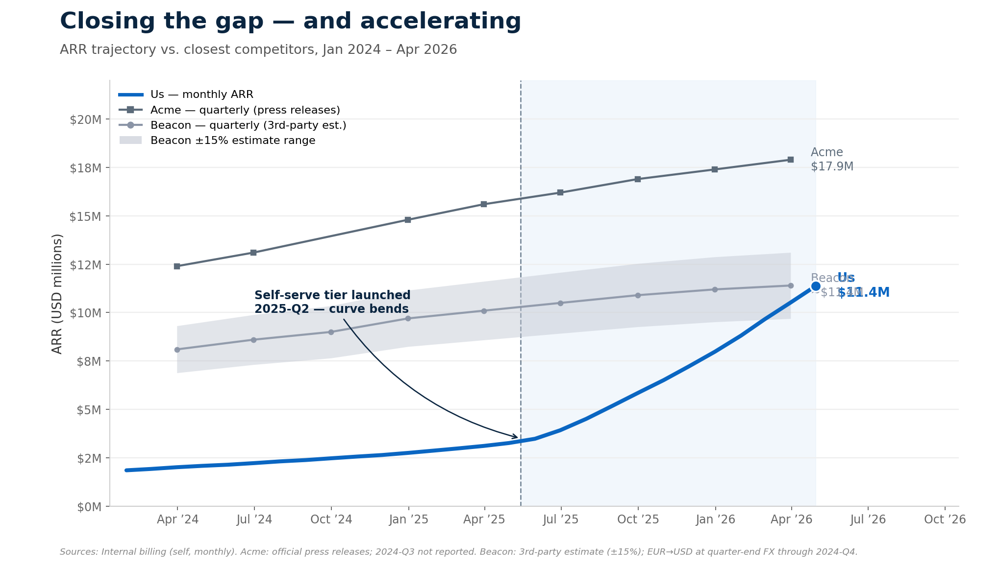</a>

**Sage** ([open full size](img/series_b_growth.sage.png))

<a href="img/series_b_growth.sage.png">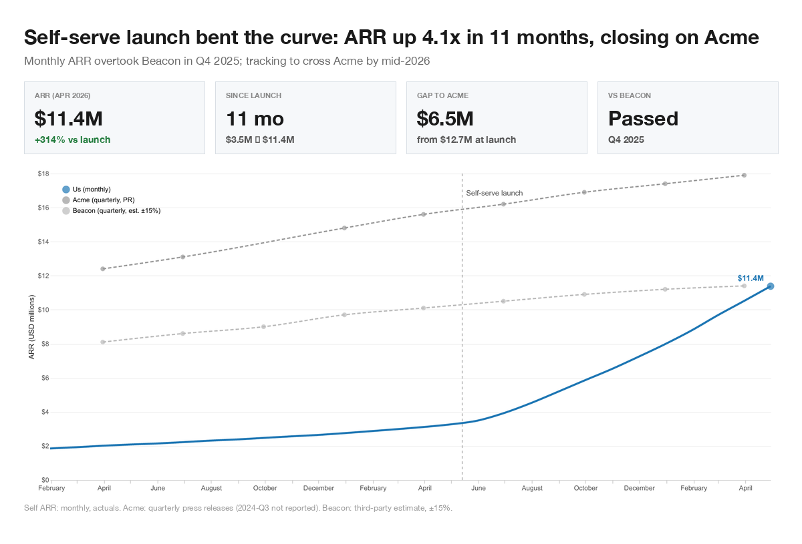</a>

## Team KPI profiles, this quarter

**Data**

Four teams are scored from 0 to 100 across five KPIs for an all-hands comparison.

**Question**

Compare each team's strengths across our five KPIs for the all-hands so people can see where each team is strong.

**The visualization challenge**

Profile and strengths language can trigger a radar chart, where area and arbitrary axis order distort comparison.

**Baseline** ([open full size](img/team_kpi_profiles.baseline.png))

<a href="img/team_kpi_profiles.baseline.png">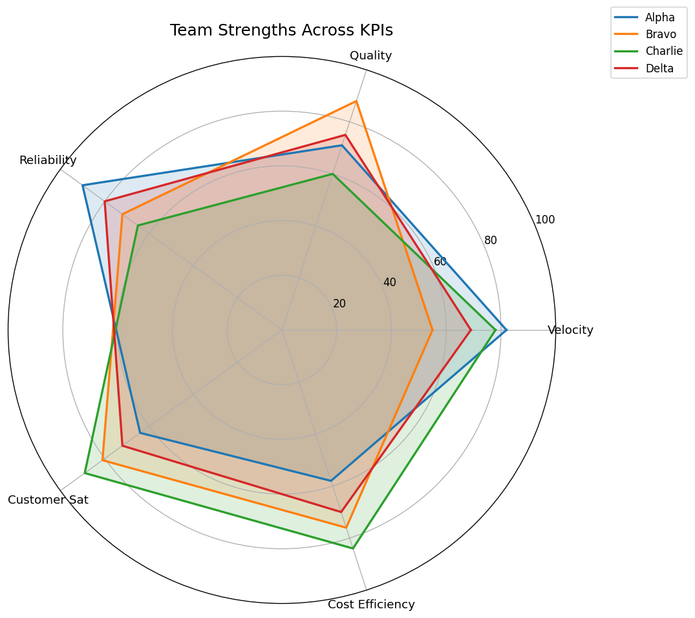</a>

**Sage** ([open full size](img/team_kpi_profiles.sage.png))

<a href="img/team_kpi_profiles.sage.png">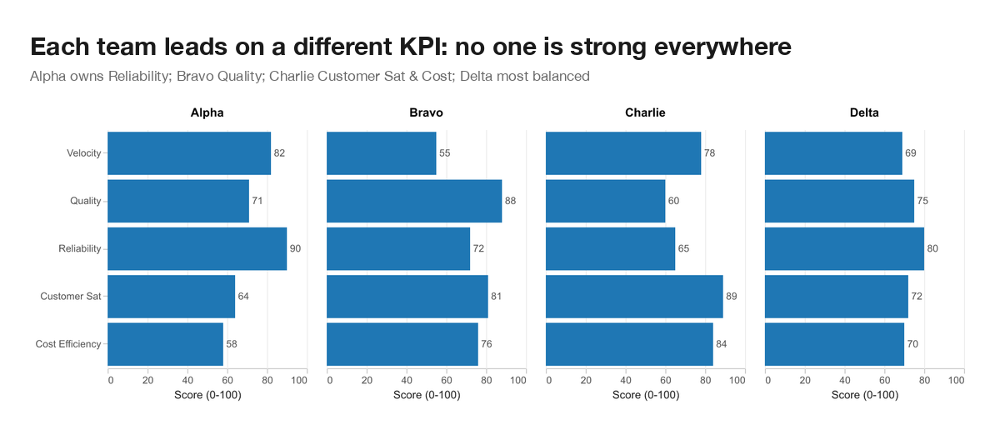</a>
